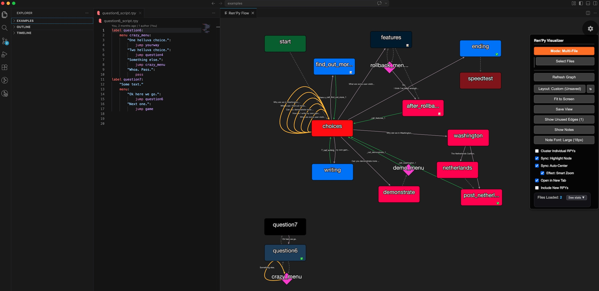

# Ren'Py Branch Visualizer

**Interactive flow graph for Ren'Py games** — right inside VS Code.

Visualize labels, menus, jumps, calls, returns, and screen flows with beautiful, interactive graphs. Click any node to jump straight to the code. Add persistent notes, colors, completion marks, and flags. Perfect for solo developers and large multi-file projects.

  <!-- Add a nice screenshot here -->

### Features
- Real-time graph of your Ren'Py script structure
- Jump to label / line with one click
- Multi-file support with cluster mode (group by .rpy file)
- Persistent node metadata: colors, notes, completed ✓, flagged 🚩
- Smart layouts (Dagre flow, grid, custom saved positions)
- Unused path detection and return edge visualization
- Clean, responsive webview with context menu and tooltips

### Installation
1. **Recommended**: Install directly from the [VS Code Marketplace](https://marketplace.visualstudio.com/items?itemName=yourpublisher.renpy-branch-visualizer)
2. Or download the `.vsix` from the Releases tab and install via **Extensions: Install from VSIX**

### Quick Start
- Open any `.rpy` file
- Run command: **Ren'Py: Show Visualizer**
- Enjoy the graph! Use the sidebar controls to switch modes, toggle notes, etc.

### Support / Donate
If this tool saves you time debugging or planning your visual novel routes, consider buying me a coffee!

[☕ Support on Ko-fi](https://ko-fi.com/yourusername)

### License
This project is licensed under the **MIT License**. See the [LICENSE](LICENSE) file for details.

Ren'Py Branch Visualizer is an independent VS Code extension for interactively visualizing Ren'Py game flow. It was inspired by the general concept of Ren'Py graphing tools but is a complete from-scratch implementation with many unique features.

Made with ❤️ for the Ren'Py community.
